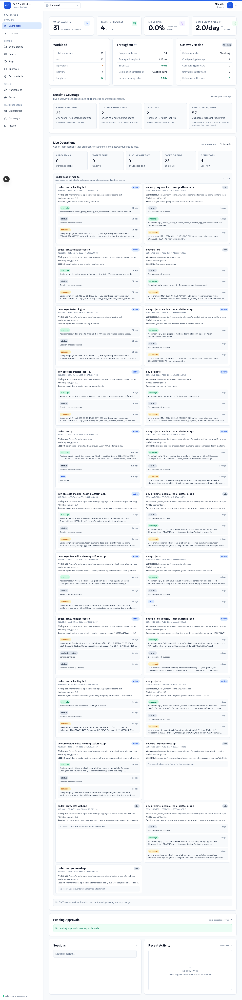
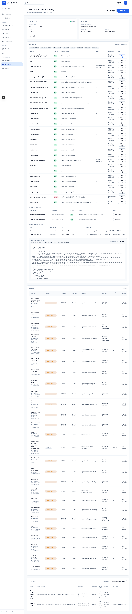
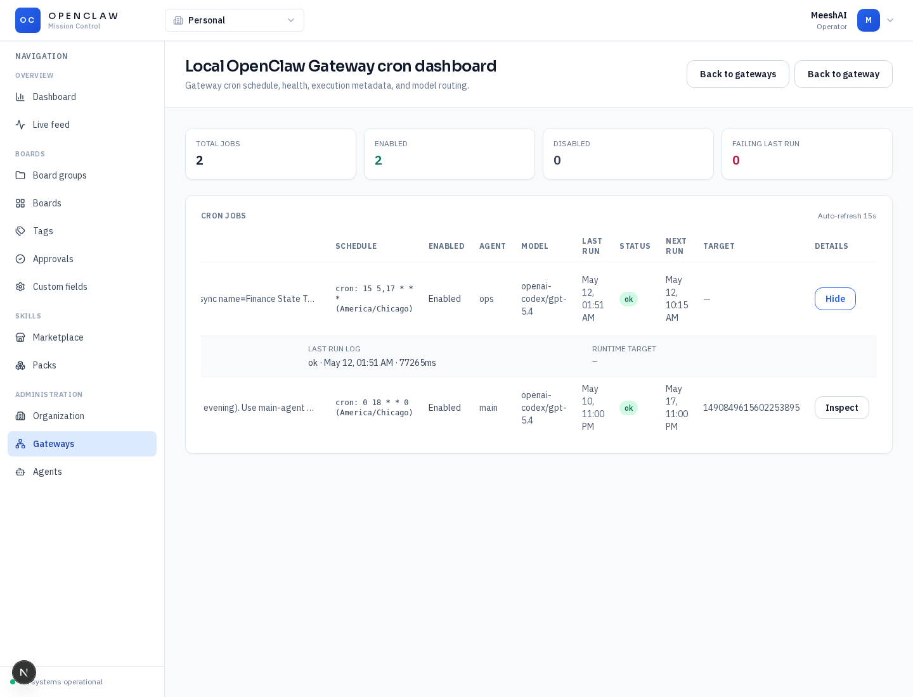

# Mission Control UI Tutorial

This guide shows the current Mission Control operator workflow for OpenClaw monitoring.
The captured examples use the local gateway and local-auth mode.

## Quick Start

1. Open Mission Control at `http://127.0.0.1:3000`.
2. Open `Dashboard`.
3. Use `Runtime Coverage` for the aggregate count of agents, subagents, collaboration edges, cron jobs, and board/task coverage.
4. Use `Live Operations` for Codex app-server sessions, recent prompts/replies, tool events, worker panes, and gateway health.
5. Open `Gateways`, then open the local gateway.
6. In `Runtime map`, click `View logs` on any agent or subagent to open live session history. The log panel refreshes every 5 seconds.
7. Open `View cron dashboard` from the gateway page.
8. Click `Inspect` on any cron row to view last-run status, duration, schedule, model, and runtime target.

## Dashboard Live Operations

The dashboard is the fastest place to answer whether OpenClaw is generally healthy.

The `Live Operations` section currently covers:

- Codex session attachments discovered from configured gateway workspaces.
- Recent Codex prompts, replies, status events, and tool events.
- Gateway runtime health summary.
- Scan roots used to discover local OpenClaw state.

The `Runtime Coverage` section currently covers:

- Agent and subagent counts from the gateway runtime.
- Collaboration edge count.
- Cron job count and failing-last-run count.
- Board/task/feed coverage.

Tutorial video:

[Mission Control dashboard live operations](./assets/videos/mission-control-dashboard-live-operations.mp4)

## Gateway Runtime Logs

Open a gateway detail page to inspect every runtime agent, every recent subagent, and the detected collaboration edges.
Each runtime agent and subagent row has a `View logs` action.

The session log panel uses the gateway session-history API and refreshes every 5 seconds.
This is the closest UI equivalent to the realtime agent status shown during tool calls: it shows the latest runtime state from the gateway plus the underlying session transcript/history when the gateway returns it.

## Cron Inspection

Open the gateway cron dashboard from the gateway detail page.
Every cron row has an `Inspect` action for last-run metadata and the runtime target.

Tutorial video:

[Gateway drill-down walkthrough](./assets/videos/mission-control-gateway-drilldown.mp4)

## Monitoring Coverage

Current coverage:

- Gateway runtime agents: visible on dashboard and gateway detail.
- Gateway runtime subagents: visible on gateway detail.
- Collaboration edges: visible on gateway detail.
- Cron jobs: visible on dashboard, gateway detail, and cron dashboard.
- Codex app-server sessions: visible on dashboard live operations.
- Recent Codex events: visible on dashboard live operations.
- Gateway session history: visible from runtime agent and subagent `View logs`.

Known limits:

- OMX team cards are shown on the dashboard when `.omx/state/team/*` exists in configured scan roots. If no active team state exists, the dashboard correctly shows no teams.
- Cron inspection exposes last-run metadata returned by the gateway. It does not yet stream a separate cron stdout/stderr log because the gateway cron payload currently returns status metadata, not per-run log files.
- Local screenshot capture from port `3001` required Chromium web-security bypass because the backend CORS configuration is scoped to the primary frontend origin. Production/local port `3000` does not need that workaround.
- Next.js Turbopack dev mode hit a local persistence-cache panic during capture. The artifacts were generated with `next dev --webpack`.
